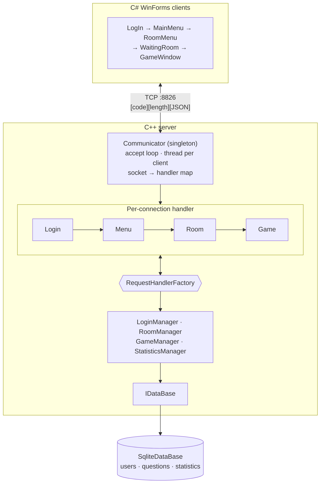

# Trivia Game

A multiplayer trivia game over a custom TCP protocol. A multithreaded C++ server holds all game state — accounts, rooms, questions, scoring — and a C# WinForms client draws it. Persistence is SQLite behind an interface.

The interesting part is not the trivia. It is that the server, not the client, decides what each connection is allowed to do next.

---

## Architecture



Each accepted socket gets its own detached thread and its own request handler. The handler *is* the connection's state.

---

## Design decisions

### The protocol state machine is made of objects, not a switch statement

A connection starts with a `LoginRequestHandler` and can only reach the menu by successfully logging in, only reach a room by creating or joining one, and only reach the game by the owner starting it. Each handler answers two questions:

```cpp
virtual bool isRequestRelevant(const RequestData&) const = 0;
virtual void handleRequest(RequestData&, RequestResult&) = 0;
```

A handler that returns a new handler in `RequestResult::_newHandler` moves the connection forward, and the communicator swaps it in:

```cpp
if (reqRes._resultCode == CODE_SUCCESS)
    setClientNewState(reqRes, sock);   // _clients[sock] = move(reqRes._newHandler)
```

**Why it matters:** a client sitting in the menu has no code path that can submit a game answer. The request is rejected by `isRequestRelevant` before any handler logic runs, and the reply is `ERROR_CODE_NOT_RELEVANT`. Protocol correctness is structural rather than a list of `if` guards that someone forgets to add to a new message type.

**Trade-off:** four handler classes and a factory instead of one function. Worth it as soon as the protocol has more than a handful of messages, and it makes "what can a client do right now?" answerable by looking at one class.

### The server owns state transitions, including other clients'

When a room owner starts the game, the server does not ask the other players to move themselves. It swaps their handlers and then tells them:

```cpp
if (requestCode == CODE_START_GAME)
    _clients[sock] = _reqHandlerFact.createGameRequestHandler(gameId, player);
DataSender::sendDataToDiffUser(sock, finalMsg);
```

The same happens in reverse when a room or game closes — every affected player is moved back to a menu handler and notified. A client that ignores the broadcast and keeps sending room messages gets rejected, because the server already moved on. The client is a view; it is never the source of truth.

### Framing: one byte of code, four bytes of length, then JSON

TCP is a byte stream with no message boundaries, so the protocol supplies its own:

```cpp
return code + string(msgLengthInBytes, 4) + msg;
```

The reader takes the code, then the length, then exactly that many bytes. Binary header for unambiguous framing, JSON body because it is readable in a packet capture and both ends already had a parser — a single-header library on the C++ side, Newtonsoft on the C# side.

**Trade-off:** hand-rolled framing means hand-rolled bugs. The current read loop issues one `recv` per field and assumes it returns everything asked for, which holds for small messages on loopback and is not true in general. Noted below.

### Disconnection is a protocol, not a cleanup

Dropping a connection means something different depending on where the player was. `closedSocketProt` branches on the handler type:

- **Login or menu** — log out, done.
- **In a room** — if the leaver owned the room, close it and broadcast to everyone in it; otherwise just remove them and tell the rest.
- **In a game** — same distinction between the creator and a participant.

Getting this wrong is what leaves ghost players in rooms and rooms that can never be closed. Because the handler knows the state, the disconnect path knows which protocol to run.

### Persistence behind an interface

Handlers never touch SQLite. They go through managers, which go through `IDataBase` — `doesUserExist`, `getQuestions`, `updateUserStatistics`, `getHighScores`. `SqliteDataBase` is the only implementation, and swapping it is a new class plus one line in `Server`.

All queries use prepared statements with bound parameters, so user input never reaches a query string.

### RAII for sockets and buffers

`DataReceiver` owns the client socket and the message buffer, and its destructor closes and frees both. Whichever way `communicateWithClient` exits — clean shutdown, a throw from a closed socket, or an unexpected exception — the socket is closed exactly once. No leak path to forget.

### Thread per client

Every connection blocks in `recv` on its own detached thread, with the socket-to-handler map shared between them. For a classroom-sized player count this is the simplest thing that works, and blocking reads keep each connection's logic linear and readable.

**Trade-off:** a thread per connection does not scale to thousands, and shared mutable state across threads is exactly where the bugs below live. An event loop would scale and would have made every handler harder to follow.

---

## Protocol

Messages are `[1 byte code][4 byte length][JSON payload]`. Codes are defined once in `ServerTrivia/Utils.h` and mirrored on the client. Broadcast messages carry an extra field identifying why they arrived — player joined or left, room closed, game started, game closed, chat message — so the client knows which unsolicited update it is handling.

## Layout

| Path | Contents |
|---|---|
| `ServerTrivia/Communicator.*` | Accept loop, per-client thread, framing, broadcast, disconnect protocols |
| `ServerTrivia/IRequestHandler.h` | Handler interface, `RequestData`, `RequestResult` |
| `ServerTrivia/*RequestHandler.*` | Login, Menu, Room, Game — one per protocol state |
| `ServerTrivia/RequestHandlerFactory.*` | Builds handlers, owns the managers |
| `ServerTrivia/RequestFactory.*`, `Json*Packet*.*` | Deserialise by code, serialise with framing |
| `ServerTrivia/*Manager.*` | Login, Room, Game, Statistics |
| `ServerTrivia/IDataBase.h`, `SqliteDataBase.*` | Persistence interface and its SQLite implementation |
| `ServerTrivia/Room.*`, `Game.*` | Room membership, question flow, per-player scoring |
| `ClientTrivia/Forms/` | One form per protocol state |
| `ClientTrivia/Communicator.cs`, `DataSender.cs`, `DataReceiver.cs` | Client networking |

## Building and running

Windows only — the server uses Winsock, the client is WinForms on .NET Framework.

1. Open `ServerTrivia/ServerTrivia.sln` in Visual Studio with the C++ workload and build.
2. Open `ClientTrivia.sln`, restore NuGet packages, build.
3. Start the server, then one or more clients. Default endpoint is `127.0.0.1:8826`.
4. Sign up, create or join a room, play.

---

## Known limitations

This is coursework from 2024, kept as written. What I would fix first, in order:

1. **Passwords are stored and compared in plaintext.** Queries are parameterised, so there is no injection here, but `doesPasswordMatch` compares the password column directly. It should be a salted hash with a slow KDF, and this is the single change I would make before anything else.
2. **A data race on the client map.** Insert and erase take `_clientLock`, but the broadcast path reassigns `_clients[sock]` without it while other threads may be reading. It works because broadcasts are rare; it is still wrong.
3. **Partial reads are not handled.** Each `recv` is assumed to return the full requested length.
4. **Debug output on the request path.** Every received message is printed to stdout.
5. **Windows-only** by dependency on Winsock and WinForms.
6. **Large media assets are committed to the repository**, which dominates clone size.

## Stack

C++ (Winsock, `std::thread`, smart pointers, abstract interfaces, factory and singleton patterns) · SQLite · C# / .NET Framework WinForms · Newtonsoft.Json · custom binary-framed JSON protocol

## License

MIT — see [`ServerTrivia/LICENSE`](ServerTrivia/LICENSE).
